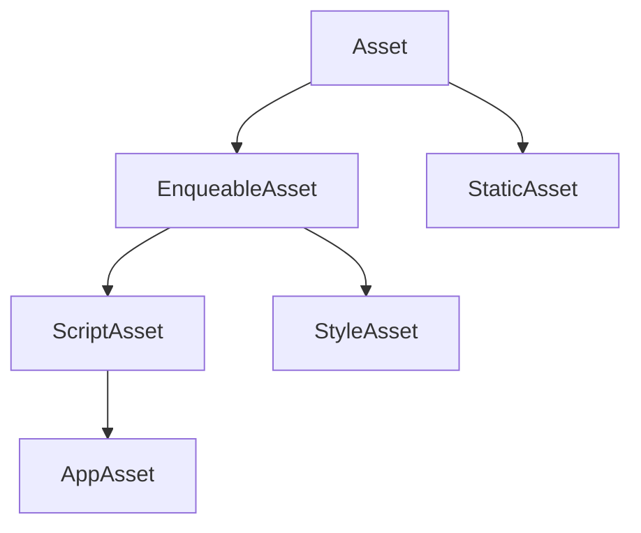

# Enquerer (Vite & HMR)

:::tip Why ModulesPress Enquerer?
ModulesPress's Enquerer system updates WordPress asset management by bringing modern frontend development practices to the WordPress ecosystem. With first-class support for TypeScript, React, SCSS, and HMR, it eliminates the complexity of managing assets in WordPress plugins.
:::

## Introduction

The traditional WordPress asset management system, while functional, wasn't designed for modern development practices. ModulesPress's Enquerer system bridges this gap by providing a type-safe, modern, and efficient way to manage your plugin's assets.

### Key Features

- 🚀 **Modern Stack Integration** - Seamless support for TypeScript, React, and SCSS
- ⚡ **Hot Module Replacement (HMR)** - Instant feedback during development
- 🔒 **Type Safety** - Full TypeScript support for better developer experience
- 📦 **Vite Integration** - Lightning-fast build tools and development server
- 🎨 **SCSS Support** - Modern CSS preprocessing capabilities
- 🔄 **Auto Path Resolution** - Intelligent handling of development and production paths
- 🛠️ **Framework Integration** - Works seamlessly with React and other modern frameworks
- 🔌 **WordPress Compatible** - Perfect harmony with WordPress's enqueuing system

## Getting Started

### Installation

The Enquerer service comes pre-installed with ModulesPress. To use it in your service, inject it through constructor dependency injection:

```php
use ModulesPress\Core\Enquerer\Enquerer;

class AdminMenuService {
    public function __construct(
        private readonly Enquerer $enquerer
    ) {}
}
```

### Vite Configuration

ModulesPress includes a powerful Vite plugin that handles the build process and development server:
:::info
`modulespress-vite-plugin` is installed by default when scaffolding a new plugin. with `modulespress new` cli command.
:::

```typescript
import ModulesPress from 'modulespress-vite-plugin';

export default defineConfig(() => ({
  plugins: [
    react(),
    ModulesPress({
      // Automatically refresh when these file types change
      refreshExtensions: [
        ".blade.php",    // Blade template changes
        ".php",          // PHP file changes
      ],
    })
  ],
}));
```

:::caution Development Server
Always ensure the Vite development server is running (`npm run dev`) when in development mode. Without it, ModulesPress will attempt to resolve production URLs from the build folder, which may cause unexpected behavior.
:::

## Asset Types Hierarchy

ModulesPress provides a comprehensive asset type system:



### Base Asset
The foundation of all assets in ModulesPress. Every asset must have a URL.

```php
// Basic asset URL resolution
$path = 'resources/scripts/main.tsx';
$assetUrl = $this->enquerer->resolveAssetUrl($path);
```

#### Resource
Or retrieve a generic asset itself from resources directory.

```php
$asset = $this->enquerer->resource('scripts/main.ts');
wp_enqueue_script("my-script", $asset->getUrl());
```
### Enqueable Asset

The base class for assets which can be enqueued using ModulePress fluent design. It provides methods for managing handle, version, and dependencies. The enqueable assets automatically have a `version` based on the plugin version by default. 

### Script Asset
Handles TypeScript files with modern module support.

```php
// Enqueue a TypeScript file with dependencies and localization
$this->enquerer->script('admin/dashboard.ts')
    ->dependencies(['jquery', 'wp-api'])
    ->enqueue()
    ->localize('dashboardData', [
        'apiUrl' => rest_url(),
        'nonce' => wp_create_nonce('wp_rest')
    ])
    ->inline("window.DASHBOARD_VERSION = '1.0.0'");

$version = $this->enquerer->script('utils/helper.ts')
    ->handle('helper')
    ->enqueue()
    ->module() //explicetly mark as module, enquerer take care of it by default
    ->getVersion(); // return version of this asset
```

### Style Asset
Manages CSS and SCSS files with advanced features.

```php
// Basic SCSS enqueuing
$this->enquerer->style('admin/styles/main.scss')
    ->enqueue();

// With media queries and conditions
$this->enquerer->style('frontend/responsive.scss')
    ->enqueue()
    ->media('screen and (min-width: 768px)');

// With inline styles
$this->enquerer->style('components/modal.scss')
    ->enqueue()
    ->inline('.modal { display: none; }');
```

### App Asset
Specifically designed for modern framework applications.

```php
// React application with HMR and styles
$app = $this->enquerer->app('admin/dashboard/app.tsx')
    ->dependencies(['wp-element'])
    ->enqueue()
    ->withStyles() // enqueue all styles for the app
    ->localize('appConfig', [
        'environment' => WP_DEBUG ? 'development' : 'production',
        'features' => ['analytics', 'reports']
    ]);

// Add static path resolver and custom configuration
$app->inline($this->enquerer->injectStaticPathResolver('staticPath'))
    ->inline("window.APP_CONFIG = " . json_encode([
        'apiEndpoint' => rest_url($this->plugin->getRestNamespace()),
        'maxUploadSize' => wp_max_upload_size()
    ]));
```

### Static Asset
For files that don't require compilation.

```php
// Image URL resolution
$logoUrl = $this->enquerer->static('imgs/logo.svg')->getUrl();

// Font enqueuing
wp_enqueue_style(
    'custom-font',
    $this->enquerer->static('fonts/custom-font.woff2')->getUrl(),
    [],
    $this->plugin->getVersion()
);
```

## Directory Structure and Organization

ModulesPress promotes a clean and organized asset structure:

```
📦 your-plugin
 ┣ 📂 resources
 ┃ ┣ 📂 apps
 ┃ ┃ ┣ 📂 admin
 ┃ ┃ ┃ ┣ 📜 app.tsx
 ┃ ┃ ┃ ┣ 📜 app.scss
 ┃ ┃ ┃ ┗ 📂 components
 ┃ ┃ ┗ 📂 frontend
 ┃ ┣ 📂 scripts
 ┃ ┃ ┣ 📜 utils.ts
 ┃ ┃ ┗ 📜 api.ts
 ┃ ┣ 📂 styles
 ┃ ┃ ┣ 📜 main.scss
 ┃ ┃ ┗ 📜 variables.scss
 ┃ ┗ 📂 types
 ┗ 📂 static
   ┣ 📂 fonts
   ┣ 📂 imgs
   ┣ 📂 js
   ┗ 📂 css
```

## Advanced Usage

### Static Path Resolution

Convenient asset path resolution in frontend code:

```php
// In PHP
$app->inline($this->enquerer->injectStaticPathResolver('assets'));
```

```typescript
// In TypeScript/JavaScript
interface Window {
    assets: (path: string) => string;
}

// Usage in React
const Logo = () => (
    
);
```

```php
// In blade templates: the @static directive is available by default in blade files.

```

:::tip
You can also implement your custom directives.
```php
#[ViewDirective("image", "onRuntime")]
public function imageDirective(string $imgPath)
{
    echo $this->enquerer->static('imgs/' . $imgPath)->getUrl();
}

// Usage in Blade:

```
:::


## Real-World Examples

### Admin Dashboard Application

```php
#[UseChecks([new IsAdminMenuCheck(self::ADMIN_MENU_PAGE_SLUG)])]
#[Add_Action('admin_enqueue_scripts')]
public function enqueueAdminAssets(): void
{
    // Enqueue main dashboard application
    $app = $this->enquerer->app('admin/dashboard/app.tsx')
        ->dependencies(['wp-components', 'wp-api-fetch'])
        ->enqueue()
        ->withStyles();

    // Add configuration and utilities
    $app->localize('dashboardConfig', [
        'restBase' => rest_url('modulespress/v1'),
        'nonce' => wp_create_nonce('wp_rest'),
        'user' => wp_get_current_user(),
        'permissions' => [
            'canManageOptions' => current_user_can('manage_options'),
            'canEditPosts' => current_user_can('edit_posts')
        ]
    ]);

    // Add static path resolver
    $app->inline($this->enquerer->injectStaticPathResolver());

    // Add utility scripts or import directly in app files using `import`
    $this->enquerer->script('admin/utils/analytics.ts')
        ->enqueue(); 

    // Add additional styles or import directly in app files using `import`
    $this->enquerer->style('admin/styles/dashboard.scss')
        ->enqueue();
}
```

### Frontend Widget Application

```php
#[Add_Action('wp_enqueue_scripts')]
public function enqueueFrontendAssets(): void
{
    if (!is_single()) {
        return;
    }

    // Enqueue widget application
    $widget = $this->enquerer->app('frontend/widget/app.tsx')
        ->dependencies(['wp-element'])
        ->enqueue()
        ->withStyles();

    // Configure widget
    $widget->localize('widgetConfig', [
        'postId' => get_the_ID(),
        'apiEndpoint' => rest_url('modulespress/v1/widget'),
        'theme' => get_option('widget_theme', 'light')
    ]);

    // Add responsive styles
    $this->enquerer->style('frontend/styles/widget-responsive.scss')
        ->enqueue()
        ->media('screen and (max-width: 768px)');
}
```

## Best Practices

### 1. Use TypeScript
ModulesPress is built with type safety in mind. Always use TypeScript for better developer experience and fewer runtime errors.

```typescript
interface WidgetConfig {
    postId: number;
    apiEndpoint: string;
    theme: 'light' | 'dark';
}

declare global {
    interface Window {
        widgetConfig: WidgetConfig;
    }
}
```

### 2. Organize Assets Properly
Follow the recommended directory structure for better maintainability:

- `apps/` for framework applications
- `scripts/` for standalone TypeScript files
- `styles/` for SCSS files
- `static/` for non-compiled assets

### 3. Leverage HMR
Always run the development server during development to take advantage of HMR and path resolutions:

```bash
npm run dev
```

### 4. Handle Production Builds
Ensure your production builds are optimized, this is necessary to build the assets for production and generate the 
manifest file:

```bash
npm run build
```

### 5. Use Dependency Injection
Take advantage of ModulesPress's dependency injection system:

```php
class WidgetService {
    public function __construct(
        private readonly Enquerer $enquerer,
        private readonly ConfigService $config
    ) {}
}
```

## Performance Considerations

1. **Selective Loading**
   - Only load assets when needed with the help of `UseChecks`
   - Implement lazy loading when possible

2. **Optimization**
   - Minimize inline scripts
   - Use production builds in production

3. **Resource Management**
   - Properly handle asset dependencies
   - Implement code splitting

## Migration Guide

### From Traditional WordPress

If you're coming from traditional WordPress development, here's how to migrate your assets:

```php
// Traditional WordPress
wp_enqueue_script(
    'my-script',
    plugins_url('js/script.js', __FILE__),
    ['jquery'],
    '1.0.0',
    true
);

// ModulesPress way
$this->enquerer->script('scripts/main.ts')
    ->handle('my-script') // can be excluded, default is url as handle
    ->dependencies(['jquery'])
    ->version('1.0.0') // can be excluded, default is plugin version
    ->inFooter() // can be excluded, default is true
    ->enqueue();
```

## Troubleshooting

### Common Issues

1. **Assets Not Loading in Development**
   ```bash
   # Ensure Vite server is running
   npm run dev
   ```

2. **HMR Not Working**
   - Ensure you're modifying imported modules rather than the main entry file
   - Changes to entry files (e.g., `app.tsx`) require full page reload
   - Move logic to imported components/modules for HMR to work properly

3. **Style Loading Issues**
   ```php
   // Always use withStyles() for apps with CSS
   $app->enqueue()->withStyles();
   ```

## API Reference

### Enquerer Methods

```php
interface Enquerer {
    public function script(string $path): ScriptAsset;
    public function style(string $path): StyleAsset;
    public function app(string $path): AppAsset;
    public function static(string $path): StaticAsset;
    public function resource(string $path): Asset;
    public function resolveAssetUrl(string $path): string;
    public function injectStaticPathResolver(string $name = 'static'): string;
    public function getAppStyles(string $path): array;
}
```

## Final Thoughts
ModulesPress's Enquerer system represents a significant step forward in WordPress plugin development. By combining modern development practices with WordPress's ecosystem, it provides an unparalleled developer experience while maintaining compatibility with WordPress's core features.