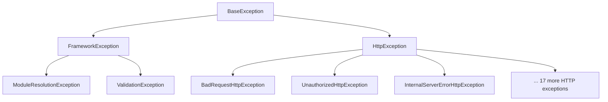

# Exception Handling

ModulesPress provides a robust, flexible exception handling system. This guide covers everything you need to know about handling exceptions in your ModulesPress plugins.

## Core Concepts

ModulesPress's exception handling system is built around these key components:

- **Base Exception Classes**: Provide foundational exception handling capabilities
- **Exception Filters**: Process and transform exceptions into appropriate responses
- **Execution Context**: Determines the appropriate response format
- **Response Types**: Support for REST, JSON, and HTML responses

## Exception Hierarchy



### Base Exception

The framework have its own abstract 'BaseException' class, all custom classes must extend 
this class. This base exception have several advantages:

- Custom data attachment during exception throwing
- Public error messages for server responses
- Debug-only reason messages
- Compatibilty with Exception Filters
- Fluent design

### Framework Exceptions

#### ModuleResolutionException: 
Thrown during plugin bootstrapping, you would see this exception mostly in development phase
- Handles module resolution failures
- Dependency missing or conflicts (e.g., circular dependencies)
- Occurs during module discovery and resolution phase

#### ValidationException:
Thrown on validation failures in pipes and entities by default.

### Built-in HTTP Exceptions

These are the built-in HTTP exception classes available. Each corresponds to a specific HTTP status code and is used to handle errors in a structured manner.

1. **BadGatewayHttpException** - Represents a `502 Bad Gateway` HTTP status.
2. **BadRequestHttpException** - Represents a `400 Bad Request` HTTP status.
3. **ConflictHttpException** - Represents a `409 Conflict` HTTP status.
4. **ForbiddenHttpException** - Represents a `403 Forbidden` HTTP status.
5. **GatewayTimeoutHttpException** - Represents a `504 Gateway Timeout` HTTP status.
6. **GoneHttpException** - Represents a `410 Gone` HTTP status.
7. **HttpException** - Generic base class for HTTP exceptions.
8. **HttpVersionNotSupportedHttpException** - Represents a `505 HTTP Version Not Supported` HTTP status.
9. **ImATeapotHttpException** - Represents a `418 I'm a teapot` HTTP status (fun Easter egg!).
10. **InternalServerErrorHttpException** - Represents a `500 Internal Server Error` HTTP status.
11. **MethodNotAllowedHttpException** - Represents a `405 Method Not Allowed` HTTP status.
12. **NotAcceptableHttpException** - Represents a `406 Not Acceptable` HTTP status.
13. **NotFoundHttpException** - Represents a `404 Not Found` HTTP status.
14. **NotImplementedHttpException** - Represents a `501 Not Implemented` HTTP status.
15. **PayloadTooLargeHttpException** - Represents a `413 Payload Too Large` HTTP status.
16. **PreconditionFailedHttpException** - Represents a `412 Precondition Failed` HTTP status.
17. **RequestTimeoutHttpException** - Represents a `408 Request Timeout` HTTP status.
18. **ServiceUnavailableHttpException** - Represents a `503 Service Unavailable` HTTP status.
19. **UnauthorizedHttpException** - Represents a `401 Unauthorized` HTTP status.
20. **UnprocessableEntityHttpException** - Represents a `422 Unprocessable Entity` HTTP status.
21. **UnsupportedMediaTypeHttpException** - Represents a `415 Unsupported Media Type` HTTP status.

## Exception Filters

Exception filters are used to intercept thrown exceptions and convert them into well-structured 
HTTP responses tailored to the plugin's context. They provide a clean and reusable way to 
manage error handling, offering the ability to log errors, apply custom logic, or return user-friendly 
messages. This ensures a consistent and professional error-handling approach throughout the plugin.

### Implementation

All Exception Filters implements the `ExceptionFilter` interface. 
This is the simplest exception filter used to alter the WP Rest API responses:

```php
#[CatchException]
class PluginExceptionFilter implements ExceptionFilter
{
    public function catchException(
        BaseException $exception,
        ExecutionContext $ctx
    ): WP_REST_Response | HtmlResponse | JsonResponse {
        $restCtx = $ctx->switchToRESTContext();
        if (!$restCtx) throw $exception; // Forwarding the exception to next filter
        $response = $restCtx->getWPResponse();
        $response->set_data([
            'customField' => 'Custom handling',
            'message' => $exception->getMessage(),
            'code' => $exception->getCode()
        ]);
        return $response;
    }
}
```

In the above example we determine the context, if we are inside a WP REST API then and only then we return
a `WP_REST_Response` with our altered data.

Exception filters must return a response of one of the following types, depending on the context and client requirements:
 
 #### WP_REST_Response
 Used when WordPress is processing a REST API request. This ensures that errors are returned in the expected format for 
 REST API clients and match the WP ecosystem.

 #### JsonResponse
 Suitable for cases where the client expects a JSON response, such as during AJAX requests. 
 This is particularly useful for edge cases where WordPress fails to initialize the 
 `WP_REST_Server` due to a server crash or implementation errors in the WP REST API. In such scenarios, 
 returning a JSON-based response ensures consistency for the client.
 
 #### HtmlResponse
 Used when the error occurs outside of API processing, such as during form submissions or 
 page navigation. This ensures that errors are displayed appropriately in an HTML format 
 suited for standard web interactions. Ideally this would replace the WP standard error screen.

### Core Exception Filter

ModulesPress comes with the default exception filter for global error handling inside your plugin.
The `CoreExceptionFilter` is the backbone of the exception handling system. It automatically:

1. Determines the correct response format
2. Maps exceptions to structured responses
3. Handles debug information
4. Provides consistent error formatting

This is a high level view of the core exception filter:

```php
#[Injectable]
#[CatchException]
class CoreExceptionFilter implements ExceptionFilter
{
    public function __construct(
        private readonly Renderer $renderer,
        private readonly ModulesPressPlugin $plugin
    ) {}

    public function catchException(
        BaseException $exception,
        ExecutionContext $executionContext
    ): WP_REST_Response | HtmlResponse | JsonResponse {
        if ($executionContext->switchToRESTContext()) {
            return $this->forRestResponse($exception, $executionContext);
        } else if (wp_is_json_request()) {
            return $this->forJsonResponse($exception, $executionContext);
        } else {
            return $this->forHtmlResponse($exception, $executionContext);
        }
    }
}
```

### Extending The `CoreExceptionFilter`

The Core Exception Filter is fully extendable, so if you want to skip checking the contexts
to return the appropriate response you can extend the core filter class and override its methods.
Now the above code for WP REST API will look like this:

```php
#[Injectable]
#[CatchException(BadRequestException::class, ValidationException::class)]
class CustomExceptionFilter extends CoreExceptionFilter
{
    public function __construct( // Automatically resolves
        private readonly Renderer $renderer,
        private readonly ModulesPressPlugin $plugin
    ) {
        parent::__construct($this->renderer, $this->plugin->isDebugMode()); // Required
    }

    protected function forRestResponse(
        BaseException $exception,
        ExecutionContext $executionContext
    ): WP_REST_Response {
        $response = $executionContext->switchToRESTContext()->getWPResponse();
        $response->set_data([
            'customField' => 'Custom handling',
            'message' => $exception->getMessage(),
            'code' => $exception->getCode()
        ]);
        return $response;
    }
}
```

Here we are overriding the `forRestResponse` method which is automatically fired if the exception is occured
in the REST context, the base class would automatically handles the other types. You can even override the
`forJsonResponse` and `forHtmlResponse` methods as well.

### Filter Registration and Execution Order

ModulesPress implements a "most-specific-first" approach to exception handling, following a 
reverse-discovery pattern. This means that more specific exception filters are executed before
more general ones, providing fine-grained control over error handling at different levels of your plugin.

Register filters at different levels:

1. **Globally** in your plugin:
```php
class YourModule extends ModulesPressModule
{
    public function pluginFilters(): array
    {
        return [
            GlobalExceptionFilter::class
        ];
    }
}
```

2. **Controller-level** using attributes:
```php
#[UseExceptionFilter(RestExceptionFilter::class)]
#[RestController("/books")]
class BooksController {}
```

3. **Method-level** for specific endpoints:
```php
#[UseExceptionFilter(SpecificExceptionFilter::class)]
#[Get("/detail")]
public function getBookDetail() {}
```

### Example of Filter Chain

You can chain the filters by keep throwing the exception within the filters, if not successfully
handled till list filter in queue, it would be handled by the core exception filter. For example,
you can create a global logging filter which would log the error and rethrow it to the core exception filter.

```php
class BookModule extends Module {
    // Level 3: Plugin Global Filter
    public function pluginFilters(): array {
        return [
            GlobalExceptionFilter::class
        ];
    }
}

// Level 2: Class-Level Filter
#[UseExceptionFilter(RestExceptionFilter::class)]
class BookController {
    // Level 1: Method-Level Filter
    #[UseExceptionFilter(SpecificExceptionFilter::class)]
    public function createBook() {
        // If an exception occurs here:
        // 1. Method-level filter tries first
        // 2. If unhandled, class-level filter tries next
        // 3. If still unhandled, global filter handles it
        // 4. Finally, CoreExceptionFilter handles any remaining unhandled exceptions and terminate.
    }
}
```

This hierarchical approach allows you to:
- Handle specific exceptions close to their source
- Provide fallback handling at higher levels
- Maintain granular control over error responses
- Ensure all exceptions are ultimately caught and handled appropriately

The `CoreExceptionFilter` serves as the final fallback, ensuring that no exception goes unhandled in your plugin.

:::tip
UseExceptionFilters can also be applied on methods of `#[Add_Action]` and `#[Add_Filter]`. So they can 
be used along side of hooks.
:::

## Exception Response Formats & Debugging

ModulesPress provides consistent, environment-aware response formats that adapt based on your debugging configuration. Let's explore each format in detail.
All these responses and formats are created by default `CoreExceptionFilter`:

### REST API & JSON Responses

#### Basic Response
The default response structure:

```json
{
    "message": "id is required",
    "statusCode": 400
}
```

This minimal format:
- Provides essential error information
- Is safe for production use
- Hides implementation details

#### Response With Errors
When the exception have errors attached to it, a new field `errors` would be added in the response.

```json
{
    "message": "id is required",
    "statusCode": 400,
    "errors": {
        "some_key": "some_value",
        "email": "Invalid email format",
        "password": "Must be at least 8 characters"
    }
}
```

:::tip Validation Errors Example
You can attach multiple validation errors to your exceptions:
```php
$e = new ValidationException();
$e->setErrors([
    "email" => "Invalid email format",
    "password" => "Must be at least 8 characters"
])
throw $e;
```
:::

#### Response With Debugging Information

ModulesPress allows you to specify which exceptions should include detailed debugging information:

```php
protected array $displayAdditionalDebuggingFor = [
    InternalServerErrorHttpException::class,
    ModuleResolutionException::class
];
```

You can override this in your custom filter:

```php
class CustomExceptionFilter extends CoreExceptionFilter
{
    protected array $displayAdditionalDebuggingFor = [
        InternalServerErrorHttpException::class,
        ModuleResolutionException::class,
        DatabaseException::class,
        CriticalBusinessException::class
    ];
}
```

When enabled for applicable exceptions, following additional fields are added in debug mode:

```json
{
    // ... basic response fields ...
    "file": "bookscontroller.php",   // Source file
    "line": 123,                     // Line number
    "filter": "CoreExceptionFilter",  // Handling filter
    "trace": [                       // Stack trace
        {
            "file": "/path/to/file.php",
            "line": 45,
            "function": "getBook",
            "class": "BooksController"
        }
    ]
}
```


### HTML Error Responses

ModulesPress provides two distinct HTML error response modes depending on your environment, offering both developer-friendly debugging and secure production error pages.

#### Development Environment (Debug Mode)

When debug mode is enabled, ModulesPress leverages the powerful Ignition package to provide an interactive debugging experience.


#### Key Debug Features

- **Interactive Stack Trace**
  - Click-through navigation of the error stack
  - Syntax-highlighted code context
  - Line-by-line execution flow

- **Detailed Error Information**
  - Exception type and message
  - File and line number references
  - Complete stack trace with context

- **Development Tools**
  - Request information (headers, parameters)
  - Server environment details
  - plugin state at time of error

#### Production Environment

In production (debug mode disabled), ModulesPress replaces WordPress's default server error page with a customizable, user-friendly error template - but only for exceptions originating from your plugin.


#### Production Features

- **Customizable Error Template**
  ```php title="views/errors/generic.blade.php"
    <div class="error-container">
        <div class="error-code">{{ $exception->getCode() }}</div>
        <h1 class="error-message">{{ $exception->getMessage() }}</h1>
    </div>
  ```

- **Security Focused**
  - No sensitive information exposure
  - Generic error messages
  - Clean, professional appearance

- **Easy Customization**
  - Fully customizable through Blade templates
  - Located in `views/errors/generic.blade.php`
  - Supports all Blade template features

#### Template Customization

You can easily customize the error template by modifying the `generic.blade.php` file:

```php
{{-- views/errors/generic.blade.php --}}
@extends('layouts.error')

@section('content')
    <div class="error-container">
        <h1>{{ __('Oops! Something went wrong') }}</h1>
        <p>{{ $exception->getMessage() }}</p>
        
        {{-- Add custom content --}}
        <div class="error-actions">
            <a href="{{ home_url() }}" class="btn">
                {{ __('Return Home') }}
            </a>
        </div>
    </div>
@endsection
```

This dual-mode error handling system ensures that you have the detailed information needed during development while maintaining security and professionalism in production.
:::danger Production Debugging
While ModulesPress allows enabling debug mode in production, it's strongly discouraged:
- Exposes sensitive implementation details
- May reveal security vulnerabilities
- Can leak business logic

Instead:
1. Use WordPress error logs
2. Implement proper logging
3. Monitor error reporting services
:::

## Specifying The Reason For Exception

All ModulesPress exceptions support a `reason` property for detailed debugging information, this will
add `reason` field in the API response and the content in the HtmlResponse in debug mode:


```php
// Basic usage
throw new BadRequestHttpException(
    "Invalid input provided",
    reason: "Expected numeric ID, received string 'abc123'"
);

// ❌ Bad
throw new BadRequestHttpException(
    "Database error: Unable to connect to MySQL on 192.168.1.100"
);

// ✅ Good
throw new BadRequestHttpException(
    "Unable to process request",
    reason: "Database connection failed: MySQL connection refused on 192.168.1.100"
);
```

```json
{
    "message": "Unable to process request",
    "statusCode": 400,
    "reason": "Database connection failed: MySQL connection refused on 192.168.1.100" // added
}
```

:::warning Debug Information Security
The `reason` property often contains sensitive implementation details. Always ensure:
- It's only used for debugging purposes
- Debug mode is disabled in production
- Sensitive data is never included in the reason
:::


## Best Practices

1. **Exception Hierarchy**
   - Extend appropriate base exceptions
   - Use HTTP exceptions for API responses
   - Create custom exceptions for specific use cases

2. **Filter Design**
   - Extend `CoreExceptionFilter` when possible
   - Override only needed response methods
   - Keep filters focused and single-purpose

3. **Debug Information**
   - Use reason property for debugging details
   - Avoid sensitive information in public messages
   - Configure debug mode appropriately

4. **Response Format**
   - Maintain consistent response structures
   - Include appropriate status codes
   - Handle all possible response types

5. **Filter Registration**
   - Use most specific scope possible
   - Consider performance implications
   - Document filter chains

## Examples

### Custom Exception Class

```php
class BookNotFoundException extends BaseException // or consider extending NotFoundHttpException instead
{
    public function __construct(
        string $message = "Book not found",
        int $code = 404,
        string $reason = "",
        ?\Throwable $previous = null
    ) {
        parent::__construct($message, $code, $reason, $previous);
    }
}
```

### Using Exceptions in Controllers

```php
#[RestController("/books")]
class BooksController
{
    #[Get("/:id")]
    public function getBook(#[Param("id")] int $id): Book
    {
        $book = $this->repository->find($id);
        if (!$book) {
            throw new BookNotFoundException(
                reason: "Book ID $id not found in database"
            );
        }
        return $book;
    }
}
```

### Custom Filter with Specific Handling

```php
#[Injectable]
#[CatchException(ValidationException::class)]
class ValidationExceptionFilter implements ExceptionFilter
{
    public function catchException(
        BaseException $exception,
        ExecutionContext $executionContext
    ): WP_REST_Response | HtmlResponse | JsonResponse {
        return new JsonResponse([
            'validation_errors' => $exception->getErrors(),
            'message' => 'Validation failed'
        ], 422);
    }
}
```

:::tip
When throwing exceptions, use the `reason` property to provide additional context that will only be visible in debug mode:

```php
throw new BadRequestHttpException(
    "Invalid input provided",
    reason: "Expected numeric ID, got string"
);
```
:::

:::warning
Be careful not to expose sensitive information in production. Always use the `reason` property for detailed error messages that should only be visible in debug mode.
:::